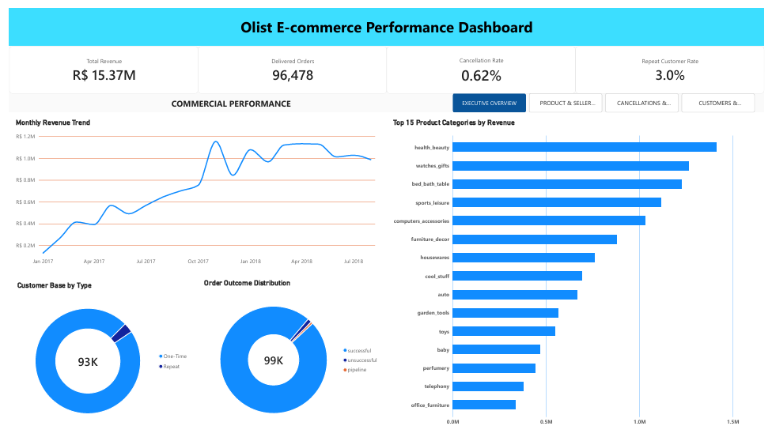

# Olist E-commerce Data Analysis

## Project Overview

## Dashboard Preview

## Project Structure

- `sql/` — PostgreSQL / SQL analysis
- `power-bi/` — Power BI dashboard and preview
- `docs/` — Business insights report
- `data/` — Dataset files (not included in the repository)

## Dataset

**Brazilian E-Commerce Public Dataset by Olist**

The dataset contains information on orders, customers, products, sellers, payments, reviews, and delivery operations.

## Analysis Areas

The project examines:
- Financial / Commercial Performance
- Product Performance & Demand
- Seller Performance
- Customer Retention
- Order & Delivery Operations
- Cancellations / Unsuccessful Orders
- Customer Satisfaction

## Project Files

- [SQL Analysis](sql/olist_analysis.sql)
- [Power BI Dashboard](power-bi/olist-ecommerce-data-analysis.pbix)
- [Business Insights Report](docs/Olist_Ecommerce_Business_Insights.pdf)
- [Dashboard Preview](power-bi/dashboard_preview.png)

## Tools

- PostgreSQL
- SQL
- Power BI

## Key Metrics

- Total Revenue: R$15.37M
- Delivered Orders: 96,478
- Cancellation Rate: 0.62%
- Repeat Customer Rate: 3.0%

## Methodology

Business Question → Data Quality Checks → KPI Definition → SQL Analysis → Power BI Visualization → Business Insights & Recommendations

## Key Metric Definitions

- Revenue = price + freight_value
- Repeat customer = customer_unique_id with more than 1 delivered order
- One-time customer = customer_unique_id with exactly 1 delivered order
- Cancellation rate = cancelled eligible orders / eligible orders
- Low review score = review score 1–3
- High review score = review score 4–5

## Project Deliverables

- PostgreSQL / SQL analysis
- Power BI dashboard
- Business insights and recommendations
- Data quality and analysis limitations
